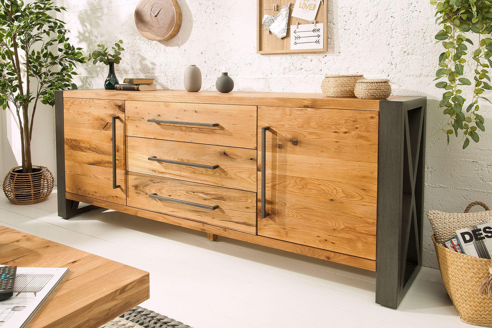

<!DOCTYPE html>
<html lang="pl">

<head> 
<meta charset="utf-8" />
<meta name="description" content="najlepsze meble">

</head>

<body>

<h1>Meblościanka - wybierz co chcesz</h1>

 
 
 
 
 

 U nas znadziesz wszystko czego potrzebujesz! 

<button></button> 

 
 
 
 
 
 
 
 
 
 
 
 

<h2> Komoda Thor</h2>

Piękne, delikatne meble w stylu francuskim… Kolekcja Venezja firmy Livin Hill to inspirująca seria dla fanów ciepłych, ponadczasowych wnętrz. Meble wykonane zostały z litego drewna brzozowego, co niewątpliwie wpływa na wyjątkowość kolekcji i jej naturalny charakter. Elementami, które czynią Venezię wyjątkową są: fantazyjne, metalowe okucia, stylizowane uchwyty oraz nieco prowansalska, beżowa kolorystyka. Bogate, sumiennie tworzone rzeźbienia wpływają na dekoracyjność mebli, będąc jednocześnie ozdobą całego wnętrza. Venezia umożliwi Ci aranżację domu w sposób, o którym marzyłeś!
    <a href="https://www.mirjan24.pl/komody/12462-komoda-nowoczesna-empire.html">szczegóły</a>

 
 
 
 
 
 
 
 
 
 
 
 
 
 
 
 

<h2> Meble kuchenne Viki</h2>

Kuchnia VIKI to zestaw mebli modułowych, który idealnie sprawdzi się w Twoim mieszkaniu !
    Możesz zdecydować jak ustawisz poszczególne elementy, tworząc kuchnię spełniającą twoje oczekiwania.
    Z szerokiej gamy tej kolekcji oferujemy szafki górne oraz dolne.
    <a href="https://bromarkt.pl/product-pol-1370-Meble-kuchenne-VIKI-1.html">szczegóły</a>

 
 
 
 
 
 
 
 
 
 
 
 
 
 
 
 

 
 
 
 
 
<iframe width="560" height="315" src="https://www.youtube.com/embed/wb2TGZ7k3ls" title="YouTube video player" frameborder="0" allow="accelerometer; autoplay; clipboard-write; encrypted-media; gyroscope; picture-in-picture" allowfullscreen></iframe>
 
 
 
 
 
 
 
 
 
 
 
 
 
 
 
 
 
 
 
 

    <label>Imię i Nazwisko <input type="text" name="imie i nazwisko"> </label>
      
    <label>Telefon <input type="text" name="telefon"></label>
      
    <label>Pytanie <input type="text" name="o co chciałbyś zapytać?"> </label> 
      
    

        <input type="submit" value="Dowiedz się więcej">
    

 
 
 
 
 
 
 
 
 
 
 
 
</body>

</html>
